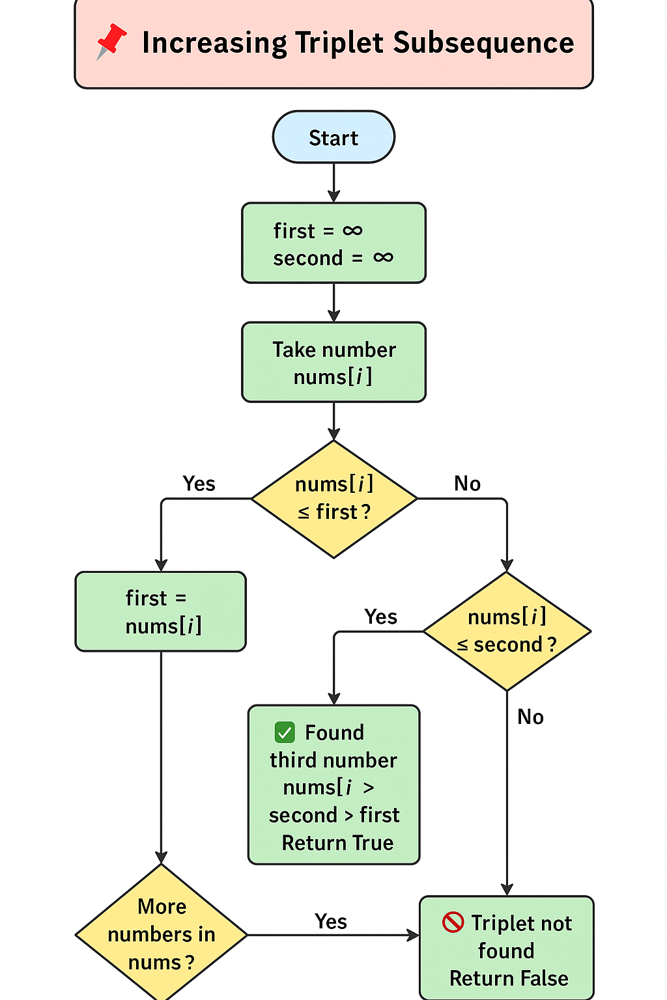

# Approach

Looking for three numbers in increasing order, we track the smallest and second smallest numbers seen so far — if we find a number larger than both, the triplet exists.

Initialize two variables (first, second) as infinity. Iterate through the array:

If num <= first, update first.
Else if num <= second, update second.
Else, return true — we found a triplet.


# Diagram




# Complexity

- Time complexity:
  O(n)

- Space complexity:
  O(1)

# Leetcode Rank

- Medium

# Code

```js
function increasingTriplet(nums: number[]): boolean {
    let first = Infinity, second = Infinity
    for(let i = 0; i < nums.length; i++) {
        if(nums[i] <= first) {
            first = nums[i]
        } else if(nums[i] <= second) {
            second = nums[i]
        } else{
            return true
        }
    }
    return false
};
```
